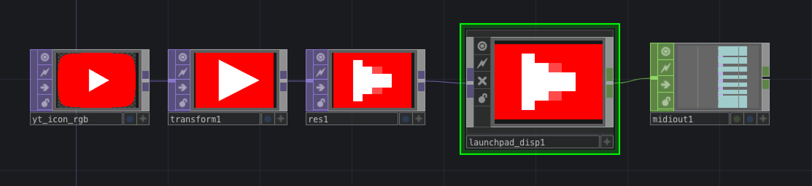
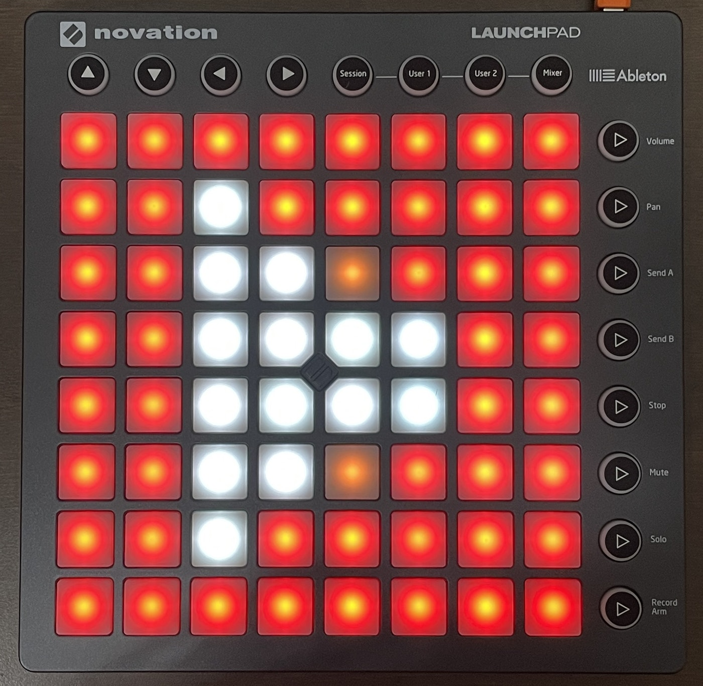

# touchdesigner-launchpad-disp

tox for displaying with Novation Launchpad

### Network Example

### Output Example

## Usage

- Connect TOP with 8px height to IN
- Connect MIDI Device Out CHOP to OUT
- You can set the width offset from Custom tab for using the multiple Launchpad

## Compatibility
- Novation Launchpad MKII

## Thanks
- https://github.com/mohayonao/launch-pad-color
  Using color map table in GLSL
